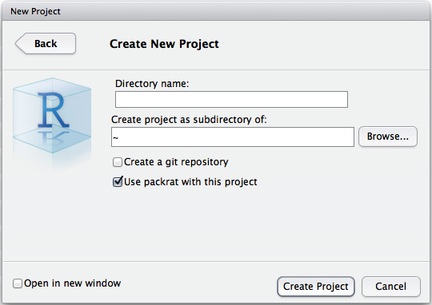
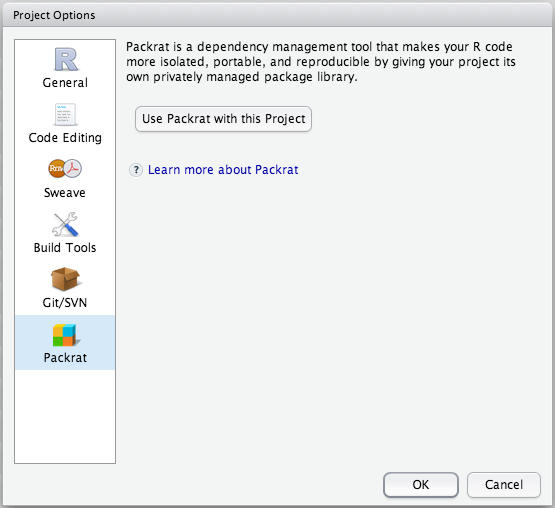
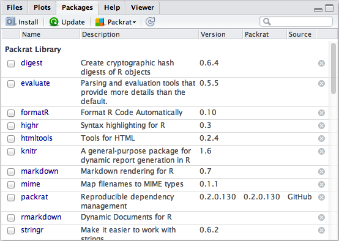
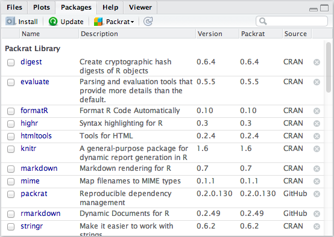
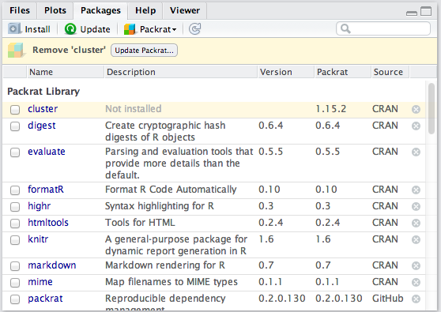
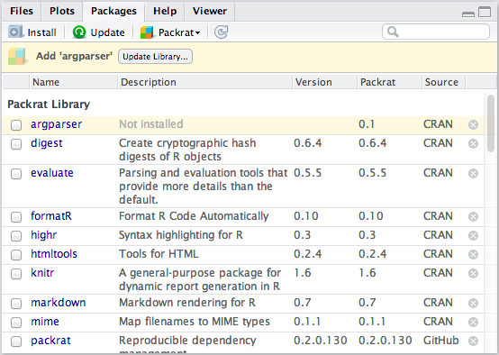
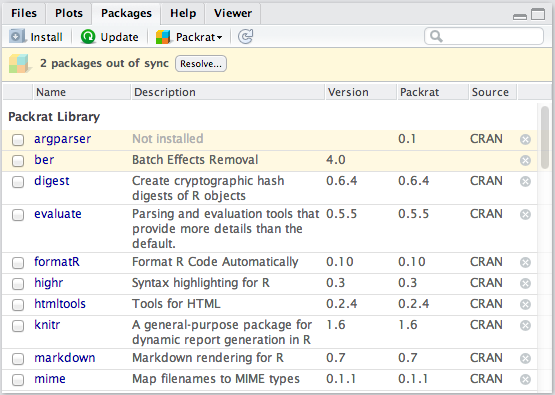
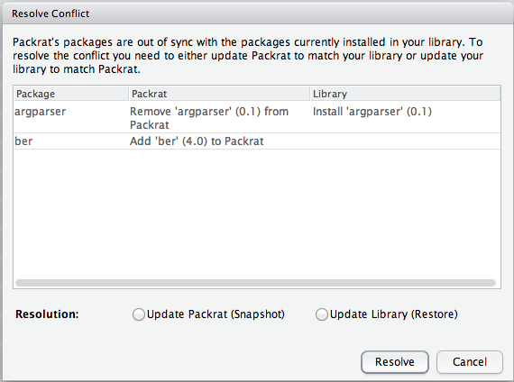
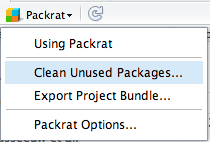
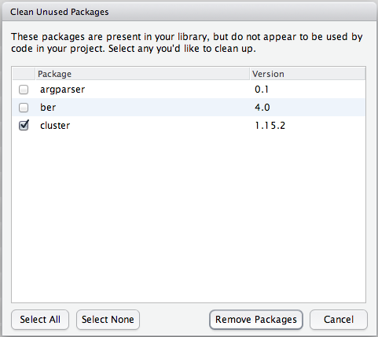

The latest version of RStudio includes built-in support for Packrat. To use it,
you'll need RStudio **0.98.945** or newer, and the very latest version of Packrat
from GitHub.

This document presumes that you're familiar with Packrat concepts; if you're
not, our [walkthrough](walkthrough.html) is a good place to get introduced.

## Packrat projects

Like Packrat projects, RStudio projects are designed around a workflow in which
your code and its resources are housed in a directory on disk. 

In a Packrat project, the Packrat "application directory" (i.e. the host for
`/packrat/`) and RStudio "project directory" (i.e. the folder that contains the
`.Rproj` file) are the same folder, so Packrat and RStudio both have the same
understanding of a project's contents and can work together to manage its
library.

If you're bringing an existing Packrat project into RStudio, you don't need to
do anything special to make it work. And if you're just starting a new project,
you can start with Packrat right away:

The new project will come with its own private library, just as though you'd
created a new directory and called `packrat::init()` on it. 

If you have an existing RStudio project you'd like to bring under Packrat
control, you can add it using the new Packrat section under Tools | Project
Options. 

## The Packages pane

While you've got a Packrat project open, the Packages pane will show you the
status of your project's private Packrat library, including the stored Packrat
version of each package. 

You can check the Packages pane any time to see what packages are available in
your private library or check for differences between your private library and
what Packrat knows about. RStudio will raise the Packages pane if there's any
action you need to take.

## Making changes

When you start a new project, one of the first things you'll want to do is add
a few packages to the Packrat library. You're free to use any tools you
normally use to install packages. Let's try
`packrat::install_github("rstudio/rmarkdown")`. Once the command finishes
you'll see the Packages pane show the new packages:

You'll notice that when you first install a pacakge, the Packrat column is
blank: this is because the package isn't stored in Packrat yet. RStudio works
behind the scenes to fetch the package's sources and save them in Packrat. This
feature is called auto-snapshotting. You can disable it in Packrat options if
you'd rather always save library changes manually.

When it's done, the pane will show that Packrat has been updated with your new
packages:

Package downgrades and removal aren't done automatically for safety reasons.
Try installing the `cluster` package; once Packrat knows about it, remove it.
You'll be prompted to save the destructive change to Packrat manually if you
really intended to make it: 

## Collaborating 

If you're collaborating using a version control system, Packrat will help keep
your private libraries in sync. RStudio watches for changes to your Packrat
lockfile. When a change from a version control system updates your Packrat
lockfile, RStudio will prompt you to apply that change to your private library.

For instance, let's say your collaborator adds a package called `argparser` as
part of a commit. When the `packrat.lock` file is updated by the version
control system, RStudio will prompt you to bring your library in sync.

## Resolving conflicts

When your library differs from Packrat, RStudio will try to guess the
appropriate action to bring them back in sync.  Notice that in the two cases we
just covered, the states were identical: a package is installed locally but not
in Packrat. RStudio tries to infer whether the appropriate action is a snapshot
(i.e. update Packrat to match the library) or restore (i.e. update the library
to match Packrat). 

In some cases, however, it won't be possible for RStudio to guess. Let's
imagine that you ignored your colleague's changes and added a package of your
own, `ber`. This will generate a conflict.

Click the *Resolve...* button:

It's not possible to cherry-pick changes--you can pick your library state or
the Packrat state, but not some of each.  It is presumed that your library
state and Packrat state each represent a consistent state, and cherry-picking
changes from each could leave your library in an inconsistent state.

## Cleaning unused packages

Package libraries can grow over time to include many packages that were needed
at one time but are no longer used. You can clean these up with the *Clean
Unused Packages* command.

This brings up a dialog that with a convenient interface over
`packrat::clean()`. 

Remember, package removes aren't auto-snapshotted, so save your changes to
Packrat once you've verified that your project's state is consistent after
cleanup.

Packrat's understanding of which packages you're using is based on some
relatively simple heuristics, so it might not always be able to figure out that
you're using a package. If you want to keep a package from appearing in the
unused list, just add a `library(packagename)` call to any .R file in your
project's directory. 

