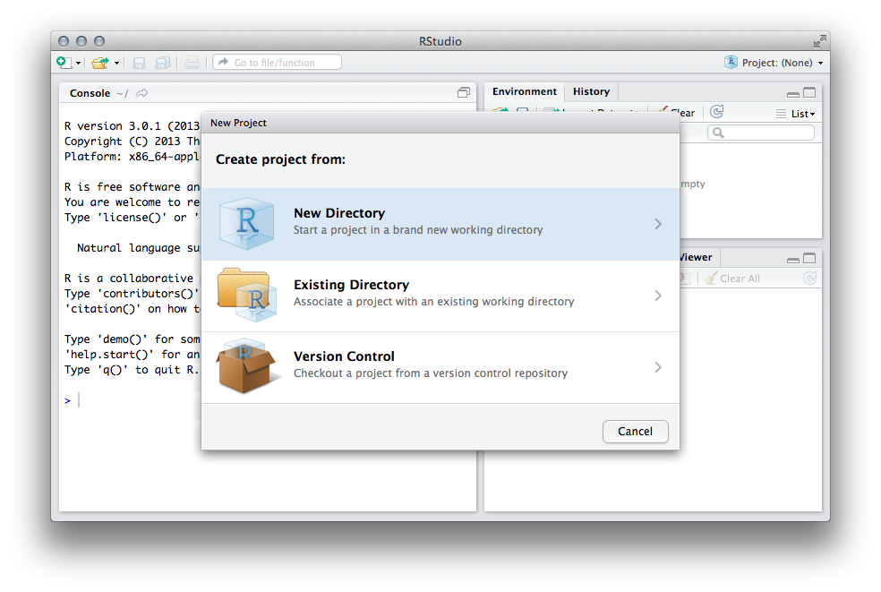
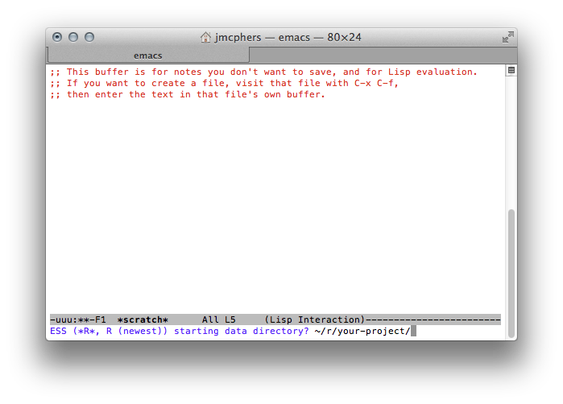

## R Projects and Directories

In Packrat, a project is just a directory of files. In order to work with the directory as a Packrat project, you need to start an R session **in the project directory**, so that R and Packrat know which project you're working with during the session. Here's how to start an R session in a particular directory using a few common IDEs:

### RStudio

In the upper right corner of the IDE, click the project picker and choose New Project. RStudio will allow you to create a new directory or use an existing one. 

Once you have created a project, opening the project will automatically start a new R session in the project's directory. 

### R GUI (Mac)

Open your Applications folder in Finder, and open a second Finder window in the directory that contains the folder for your project. Drag your project's folder icon onto the R icon. A new R GUI session will start in the chosen directory.

### R GUI (Windows)

Right-click on the shortcut you use to open R GUI, and choose Properties. Change the "Start in:" value to the directory for your project, then restart R GUI.

### ESS

By default, ESS will prompt you for the working directory to use when starting the R process. Simply enter the path to your project's directory.

ESS can be configured to choose a directory automatically (for instance, it may use the working directory of the current buffer); if you don't get a directory prompt, see [Customizing Startup](http://ess.r-project.org/Manual/ess.html#Customizing-startup) in the ESS manual for more information. 

### Other IDEs

Packrat should work with any other IDE--just be sure that the current working directory when the R session starts is your project's directory.